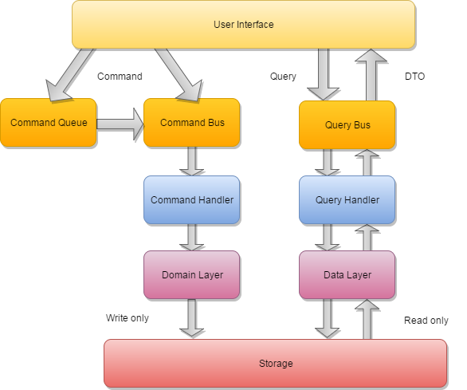

[](https://packagist.org/packages/gpslab/cqrs)
[](https://packagist.org/packages/gpslab/cqrs)
[](https://travis-ci.org/gpslab/cqrs)
[](https://coveralls.io/github/gpslab/cqrs?branch=master)
[](https://scrutinizer-ci.com/g/gpslab/cqrs/?branch=master)
[](https://insight.sensiolabs.com/projects/a7885c13-685e-49bc-b1e7-635010540f21)
[](https://styleci.io/repos/92310135)
[](https://github.com/gpslab/cqrs)

# Infrastructure for creating CQRS applications.



## Installation

Pretty simple with [Composer](http://packagist.org), run:

```sh
composer require gpslab/cqrs
```

## Command

* **[Simple usage](docs/command/simple_usage.md)**
* [Bus](docs/command/command_bus.md)
* Handler
  * [Create handler](docs/command/handler.md)
  * Locator
    * [Direct binding locator](docs/command/locator/direct_binding.md)
    * [PSR-11 Container locator](docs/command/locator/psr-11_container.md) *([PSR-11](https://github.com/php-fig/fig-standards/blob/master/accepted/PSR-11-container.md))*
    * [Symfony container locator](docs/command/locator/symfony_container.md) *(Symfony 3.3 [implements](http://symfony.com/blog/new-in-symfony-3-3-psr-11-containers) a [PSR-11](https://github.com/php-fig/fig-standards/blob/master/accepted/PSR-11-container.md))*
* Queue
  * Custom queue
  * [Memory queue](docs/command/queue/memory_queue.md)
  * [Memory unique queue](docs/command/queue/memory_unique_queue.md)
  * [Predis queue](docs/command/queue/predis_queue.md)
  * [Predis unique queue](docs/command/queue/predis_unique_queue.md)
* [Middleware](https://github.com/gpslab/middleware)
* [Payload](https://github.com/gpslab/payload)

## Query

* **[Simple usage](docs/query/simple_usage.md)**
* [Bus](docs/query/query_bus.md)
* Handler
  * [Create handler](docs/query/handler.md)
  * Locator
    * [Direct binding locator](docs/query/locator/direct_binding.md)
    * [PSR-11 Container locator](docs/query/locator/psr-11_container.md) *([PSR-11](https://github.com/php-fig/fig-standards/blob/master/accepted/PSR-11-container.md))*
    * [Symfony container locator](docs/query/locator/symfony_container.md) *(Symfony 3.3 [implements](http://symfony.com/blog/new-in-symfony-3-3-psr-11-containers) a [PSR-11](https://github.com/php-fig/fig-standards/blob/master/accepted/PSR-11-container.md))*
* [Middleware](https://github.com/gpslab/middleware)
* [Payload](https://github.com/gpslab/payload)
* [Doctrine specification query](https://github.com/gpslab/specification-query)

## License

This bundle is under the [MIT license](http://opensource.org/licenses/MIT). See the complete license in the file: LICENSE
